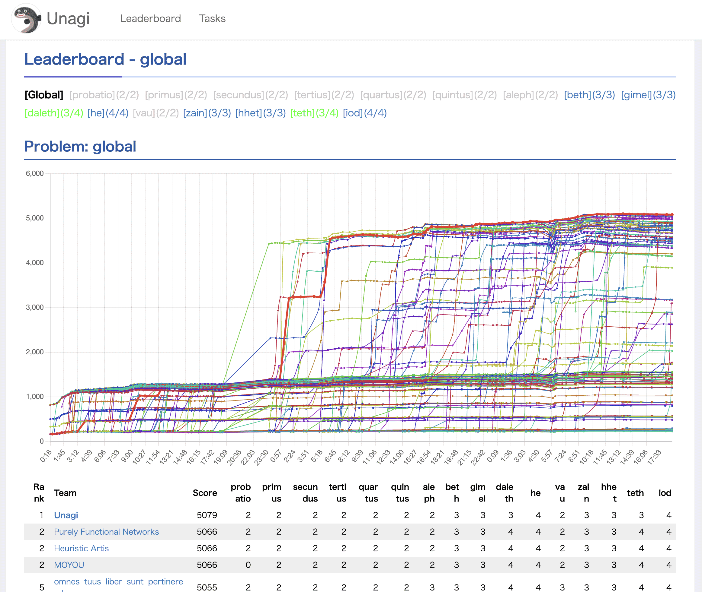

# Team Unagi
Team Unagi's repository for the ICFP Programming Contest 2025.

## Members
* Takuya Akiba
* Kentaro Imajo
* Hiroaki Iwami
* Yoichi Iwata
* Toshiki Kataoka
* Naohiro Takahashi

## Problem Summary

The task is to reconstruct an undirected graph map that is observationally (action-) equivalent to the true maze of hexagonal rooms (doors numbered 0–5), using only the 2-bit labels (0–3) visible upon each visit, while minimizing queryCount. Each exploration starts from the same room and follows a predetermined sequence of doors (a route plan; digits 0–5). Self-loops, parallel edges, and transitions that return to the same door are allowed. Executing a plan of length L yields a label trace of length L+1. Each plan must satisfy L ≤ 18n, where n is the number of rooms. The /explore endpoint accepts batch submission of multiple plans; queryCount equals “the number of executed plans plus 1 per /explore call,” so batching is advantageous. Map correctness uses observational equivalence: two maps are considered equivalent if no route plan can distinguish them.

In the Full Division, the per-plan traversal limit is 6n, and room labels can be modified by marking upon passage. Additionally, some instances multiplex the base graph (duplicated 2× or 3×).

Scoring: Local rankings per problem are by ascending queryCount. Global ranking uses the Borda count (sum over problems of the number of teams each team surpasses).

## Approach

### Summary
Our final solution was built around a SAT solver as its core component. Through observation, we inferred that the problems could likely be solved with an extremely small number of queries. We believed that by encoding all available information into a single SAT instance and solving it in one pass, we could utilize every piece of data simultaneously without any waste. This strategy would allow us to achieve a query count close to the optimal value, which we considered essential for securing a top rank.

### Lightning Division Approach
*Code: `src/bin/iwiwi_evo_gen276.rs`*

We successfully achieved a score of 2 (optimal) on all problems in this division. Our basic approach was a two-step process: (1) generate a random walk-style plan, and (2) use the response from that plan to find a consistent graph with a SAT solver (CaDiCaL).

We pre-generated an optimized random walk-style plan using a greedy algorithm designed to visit as many vertices and edges as possible, and we submitted this same plan for each query (see `iwiwi_routing_v3.rs`). 

We were able to accelerate the SAT solving process through several techniques: reducing the number of variables in the encoding, adding helpful clauses (e.g., for symmetry breaking), and introducing auxiliary variables to encourage branching on important variables (e.g., variables representing a door's destination vertex, independent of the corresponding door it connects to).

During the Lightning round, we couldn't consistently solve the largest problem (30 rooms) within a realistic timeframe. To work around this, we implemented a strategy where we would only proceed with the SAT solving phase if we received a "lucky" response. If the response was "unlucky," we would abandon the attempt and move on to the next session. The determination of "lucky" vs. "unlucky" was based on metrics such as the frequency of label appearances.

After the Lightning round ended, this part of our solution was further optimized with techniques like SAT solver portfolio implementation and parallelization, which enabled us to solve the 30-room problem stably in about 5 minutes (see `src/solve_no_marks.rs`).

---

### Full Division Approach 1: Two-Stage Approach
*Code: `bin/src/wata_sat3.rs`*

For the initial phase of the Full Division, we developed a two-stage approach. This involved: (1) first, identifying the structure of the original, pre-multiplexed graph, and (2) second, determining how that graph was multiplexed.

To minimize the `queryCount` cost, we performed the `explore` operation only once. In this single exploration, we used multiple plans that were designed to gather the necessary information for both stages. A typical submission might consist of three plans: the first two without any charcoal marks (for stage 1) and the final plan with charcoal marks (for stage 2). To further reduce costs, we also utilized mixed plans. In a single plan, for instance, the strategy would change midway: the first half of the journey would involve no marking, while the second half would include marking. Using these mixed plans contributed to lowering our scores on some problems.

Using the labels from the response, we first applied our Lightning Division approach to identify the original, pre-multiplexed graph. With this base graph, we could perfectly reconstruct which vertex we were at for every step of our submitted plans. Next, using this vertex sequence information and the response from the charcoal-marking plan, we determined the specific permutation of how all edges were multiplexed. This latter step was also solved using a separate SAT solver. This second SAT instance was quite lightweight and solved reliably.

Making this approach work correctly was more difficult than we imagined and required challenging debugging. The main issue was graph ambiguity. The graph produced by the first-stage "lightning solver" is not unique; it's impossible to fully determine the topology of parallel edges and self-loops. This ambiguity in parallel edges and self-loops, however, affects the final graph that can be represented in the second stage when identifying the multiplexed connections. Therefore, we had to be careful with our SAT representation, relaxing the graph definition to handle parallel edges and self-loops comprehensively.

Solutions submitted using this approach were ultimately used for problems **he(2\*30)**, **zain(3\*12)**, **hhet(3\*18)**, **teth(3\*24)**, and **iod(3\*30)**. Notably, on **teth**, we were the only team to achieve a score of 3 at the time of the leaderboard freeze. For that problem, we submitted two plans: one for the first stage and another for the second.

### Full Division Approach 2: One-Stage Approach
*Code: `bin/src/chokudai_sat_d3.rs`, `bin/src/wata_sat4.rs`, `bin/src/wata_sat6.rs`*

To further improve our scores, especially on smaller problems, we developed a unified, one-stage approach that solved the entire problem at once. By treating everything as variables—where each door leads, which vertex was marked, etc.—we could encode the entire problem into a single SAT instance. Since this method leverages all information from the `explore` phase exhaustively, it produces better scores than the two-stage approach when it runs successfully. However, the SAT instance becomes much larger and takes more time, so it was only feasible for smaller problems.

We created two main variations of this one-stage solver. The first used a relatively straightforward SAT representation. For example, to represent "which vertex we are at, at what time," it would create a number of variables equal to the total number of post-multiplexed vertices. This approach was strong on instances with 3x multiplexing, and the solution based on it, `chokudai_sat_d3.rs`, solved **vau(3\*6)** with score two.

The other variation used a SAT representation inspired by our two-stage approach. By representing the base graph's topology and the multiplexing method as separately as possible, it encourages the SAT solver to work in a manner similar to the two-stage process, making the problem more approachable for the solver. The plans used for this one-stage approach were generally structured like those in the two-stage method—the first part without charcoal marks (for topology) and the second part with them (for multiplexing). Building the SAT instance to focus on topology first made the solving process more natural. The solvers based on this approach, `wata_sat4` and `wata_sat6`, solved **aleph(2\*6)**, **beth(2\*12)**, **gimel(2\*18)**, and **daleth(2\*24)**. On **daleth**, in particular, we were the only team to have achieved a score of 3 when the leaderboard was frozen.

## Acknowledgements

We would like to thank the organizers for holding such a wonderful contest.

